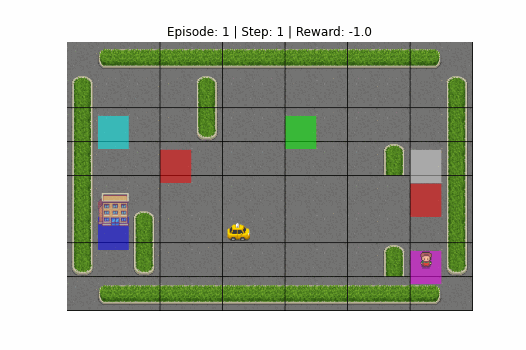
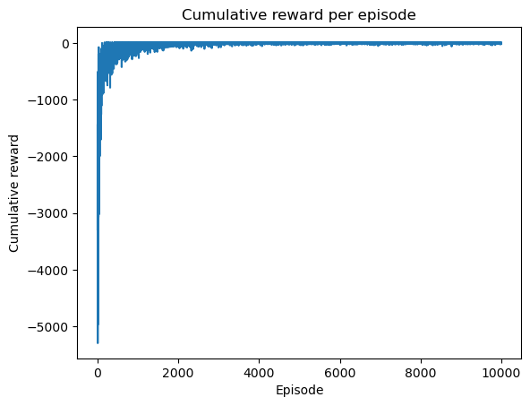
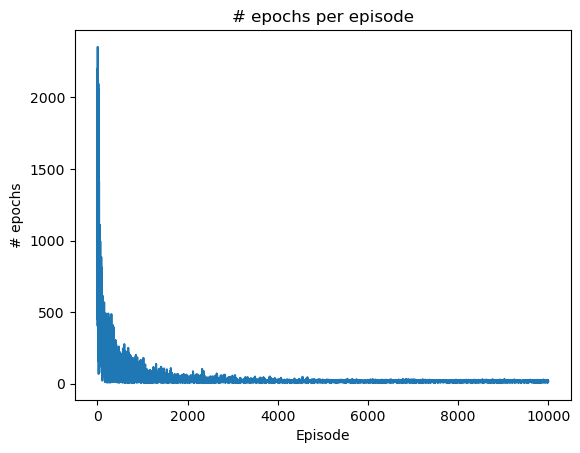

Autonomous Taxi Agent using Q-Learning
This project a reinforcement learning project that uses the Gymnasium library to create a custom environment for a taxi driver. The taxi driver is trained using the Q-Learning algorithm to navigate the environment and pick up and drop off passsengers. The taxi learns to optimize its path, avoid obstacles and restricted areas to maximize its reward.

I used this project as reference :
https://github.com/woutervanheeswijk/taxi_environment?tab=readme-ov-file

- Custom environment:
  the project has a custom 6x6 grid with 5 dropoff/ pickup locations and 2 restricted areas.

````
```
MAP = [
"+-----------+",
"| : | : : : |",
"|A: | :B: : |",
"| :R: : : |C|",
"| : : : : :R|",
"|D| : : : : |",
"| | : : : |E|",
"+-----------+",
]
```
````

The letters A,B,C,D,E represent the pickup and dropoff locations. The restricted area R is marked with a red square. The '|' symbol represents the walls of the environment.
Visually, I wasn't able to get the grid lines to fit the map properly, however that does not affect the performance of the agent.

  

- Reward system:
  The reward system is the same as the Gymnasium Taxi-v3 environment:

  - -1 for each time step taken
  - +20 for successfully dropping off a passenger
  - -10 for illegal illegal pickup/dropoff

- Actions:
  There are 6 actions:
  0: move south
  1: move north
  2: move east
  3: move west
  4: pickup passenger
  5: drop off passenger

- Hyperparameters:
  - Episodes: 10,000
  - Alpha (Learning Rate): 0.1
  - Gamma (Discount Factor): 1.0
  - Epsilon (Exploration Rate): 0.1

- Q-Learning algorithm:
  the project implements the Q-Learning algorithm to train the taxi driver. The algorithm updates the Q-values based on the rewards received and the taxi's actions. The Q-Table is saved to a CSV file for future use without re-training.

- Evaluation:
  The agent is evaluated every 300 episodes during training. Then, tracks and saves the best model based on cumulative reward.
  
How to run:
To train the agent from scratch:

1. Open the Jupyter Notebook taxi_q_learning.ipynb.
2. Run the cells containing the TaxiEnv class definition and the visualization methods.
3. Run the Training cell.
   o This will train the agent for 10,000 episodes.
   o It will automatically save the best Q-Table to taxi_q_table.csv.
4. Test policy performance after training:
   o Run the Testing cell.
   o This will load the Q-Table from taxi_q_table.csv and run the agent in the environment.
   o It will display the final reward and a visualization of the agent's path.

- Results:

  


  


  Accourding to the results, the agent showed an excellant performance and was able to learn its way pretty early on, achieving its best cumulative reward of 16.0 at Episode 488.
